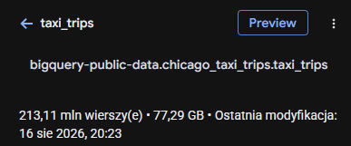
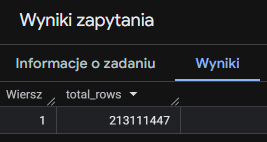
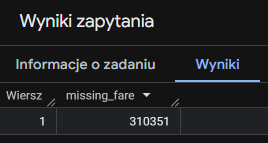
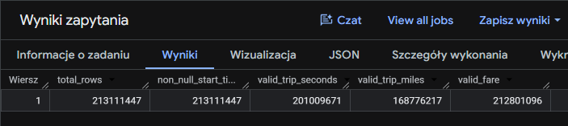
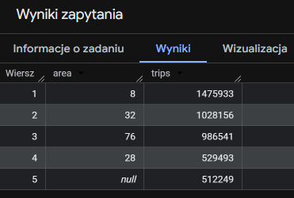
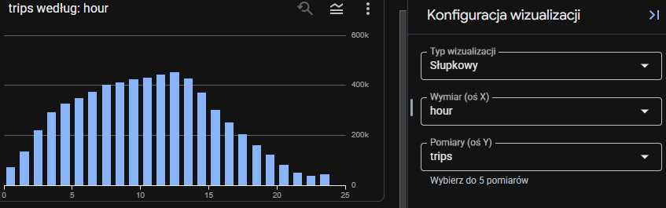
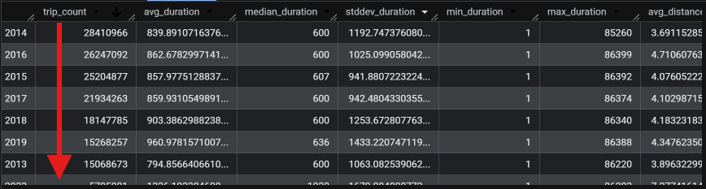
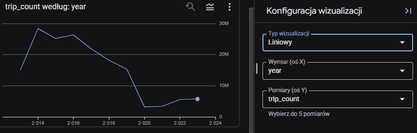

# Analiza danych w Google BigQuery

Korzystając z dostępu do zbioru danych dotyczących podróży taksówkami w Chicago w Google BigQuery przeprowadziłem analizę, w której:
- sprawdziłem co zawiera zbiór danych
- oceniłem jakość danych
- sformułowałem wnioski i rekomendacje biznesowe
- wykorzystałem zapytania SQL do analizy danych
  
Link do zbioru danych:
- https://console.cloud.google.com/marketplace/product/city-of-chicago-public-data/chicago-taxi-trips

---
## Przed analizą
### Sprawdzam rozmiar zbioru danych oraz liczbę wierszy


```sql
SELECT COUNT(*) AS total_rows
FROM `bigquery-public-data.chicago_taxi_trips.taxi_trips`;
```


### Sprawdzam, czy kolumna `fare` zawiera poprawne wartości
```sql
SELECT COUNT(*) AS missing_fare
FROM `bigquery-public-data.chicago_taxi_trips.taxi_trips`
WHERE fare IS NULL OR fare <= 0;
```


Kolumna `fare` oznacza opłatę za przejazd taksówką. W analizowanym zbiorze nieprawidłowe wartości stanowią mniej niż 1% wszystkich rekordów.

### Sprawdzam więcej kolumn jednym zapytaniem
```sql
SELECT
COUNT(*) AS total_rows,
COUNT(trip_start_timestamp) AS non_null_start_timestamp,
COUNTIF(trip_seconds > 0) AS valid_trip_seconds,
COUNTIF(trip_miles > 0) AS valid_trip_miles,
COUNTIF(fare > 0) AS valid_fare
FROM `bigquery-public-data.chicago_taxi_trips.taxi_trips`;
```


Warto również sprawdzić, czy w zbiorze występują duplikaty.

---

## Analiza

### Najpopularniejsze obszary początkowe, rok 2022
```sql
SELECT pickup_community_area AS area, COUNT(*) AS trips
FROM `bigquery-public-data.chicago_taxi_trips.taxi_trips`
WHERE trip_start_timestamp BETWEEN '2022-01-01' AND '2022-12-31'
GROUP BY area
ORDER BY trips DESC
LIMIT 5;
```


### Liczba przejazdów według godziny, rok 2022
Należy zwrócić uwagę na strefę czasową. Dane czasowe są przedstawione w UTC, dlatego przed analizą godzinową należy uwzględnić czas lokalny Chicago.
```sql
SELECT
EXTRACT(HOUR FROM trip_start_timestamp AT TIME ZONE 'America/Chicago') AS hour,
COUNT(*) AS trips
FROM `bigquery-public-data.chicago_taxi_trips.taxi_trips`
WHERE EXTRACT(YEAR FROM trip_start_timestamp AT TIME ZONE 'America/Chicago') = 2022
GROUP BY hour
ORDER BY trips DESC;
```


### Średnia, przybliżona mediana i odchylenie standardowe w poszczególnych latach
```sql
SELECT
EXTRACT(YEAR FROM trip_start_timestamp) AS year,
COUNT(*) AS trip_count,

-- Duration
AVG(trip_seconds) AS avg_duration,
APPROX_QUANTILES(trip_seconds, 100)[OFFSET(50)] AS median_duration,
STDDEV(trip_seconds) AS stddev_duration,
MIN(trip_seconds) AS min_duration,
MAX(trip_seconds) AS max_duration,

-- Distance
AVG(trip_miles) AS avg_distance,
APPROX_QUANTILES(trip_miles, 100)[OFFSET(50)] AS median_distance,
STDDEV(trip_miles) AS stddev_distance,
MIN(trip_miles) AS min_distance,
MAX(trip_miles) AS max_distance,

-- Fare
AVG(fare) AS avg_fare,
APPROX_QUANTILES(fare, 100)[OFFSET(50)] AS median_fare,
STDDEV(fare) AS stddev_fare,
MIN(fare) AS min_fare,
MAX(fare) AS max_fare

FROM `bigquery-public-data.chicago_taxi_trips.taxi_trips`

WHERE trip_start_timestamp IS NOT NULL
AND trip_seconds > 0
AND trip_miles > 0
AND fare > 0

GROUP BY year
ORDER BY year;
```




---

## Google PowerQuery → Power BI (DirectQuery)
W tym przypadku do analizy danych w Power BI można wykorzystać tryb DirectQuery zamiast klasycznego importu danych. W trybie DirectQuery dane pozostają w źródle, a Power BI wysyła zapytania do bazy danych w momencie wykonywania analizy. Dzięki temu nie ma potrzeby importowania całego zbioru danych do pamięci Power BI. 

Niektóre kolumny w tej bazie danych zawierają w większości puste wartości. Dla poprawy wydajności warto pominąć nieużywane kolumny, tworząc odpowiednio przygotowane zapytanie SQL.

Jeśli interesuje nas głównie jakiś okres czasu to (próbka, np. ostatnie 2-3 lata) to można również użyć odpowiedniego zapytania SQL, aby wygenerować odpowiednie dane oraz zaimportować je bezpośrednio do Power BI, do szczegółowej analizy.

Plik .pdf dotyczący wizualizacji wszystkich danych w Power BI jest dostępny wyżej. Należy po prostu w niego kliknąć lub go pobrać.

---

## Wnioski i rekomendacje
**Analiza cenowa:** Utrzymać ceny konkurencyjne latem, a zimą rozważyć promocje (np. rabaty na nocne kursy), żeby przyciągnąć klientów mimo słabszego popytu.

**Optymalizacja tras i harmonogramów:** Skoncentrować taksówki w najbardziej ruchliwych obszarach (Area 8 to Near North Side) szczególnie w godzinach szczytu (03:00 - 13:00). Zapewnienie gotowości w dzielnicach generujących najwięcej postojów zwiększy liczbę zleceń.

**Segmentacja klientów:** Skupić działania marketingowe na obszarach generujących największą liczbę przejazdów. W przypadku obszarów biznesowych i turystycznych można rozważyć kampanie skierowane do osób podróżujących służbowo oraz turystów.

**Analiza konkurencji:** Monitorować firmy posiadające największy udział w liczbie realizowanych przejazdów, takie jak Taxi Affiliation Services oraz analizować ich ofertę i stosowane rozwiązania.

---

## Co jeśli tych danych będzie 10 razy więcej?

### Skalowanie do większych zbiorów
Jeśli dane byłyby **10 razy większe**, nadal da się je analizować BigQuery, ale trzeba zastosować dodatkowe optymalizacje. Przede wszystkim warto **partycjonować tabelę**, np. po dacie kursu, co pozwoli czytać tylko pasujące partycje zamiast całej tabeli. Można też **klastrować** tabelę po kluczowych kolumnach (np. po obszarze community), co przyspieszy filtrowanie wielowymiarowe. Pozwala to znacząco ograniczyć ilość danych przetwarzanych w zapytaniu. Dodatkowe kroki to korzystanie z **próbkowania** danych i optymalizacja samego zapytania. Jeśli BigQuery jest niewystarczające, można sięgnąć również po inne narzędzia.